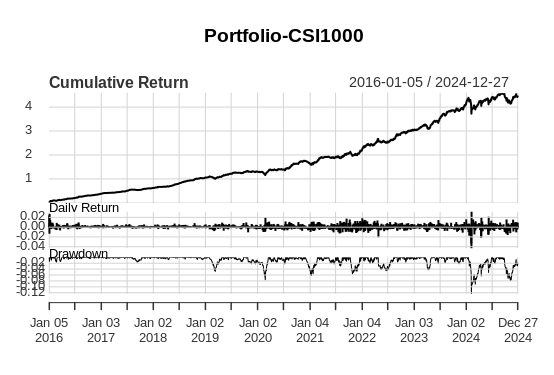
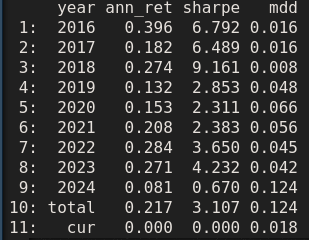

# 因子数据 & 回测结果

## 因子数据
1. 所展示的为截至2024.12为止的基础因子等权合成结果；
2. 风险报告为月频回测的持仓风险分析；

## 回测结果
1. 回测结果分类：依据交易频率{每日，5日，20日}，分组组数{5组，10组}共得6组回测结果，其中日频交易额外测试前5%标的的交易结果；
2. 回测参数：买卖滑点0.1%，交易费率2.5%%，印花税0.1%。双边费率共0.35%；
3. 命名示例：pos_G10_month表示10分组，20日换仓的回测结果。以下展示该回测结果下的多头相对中证1000的超额表现：

# run load_res_data.py展示年化指标结果；

